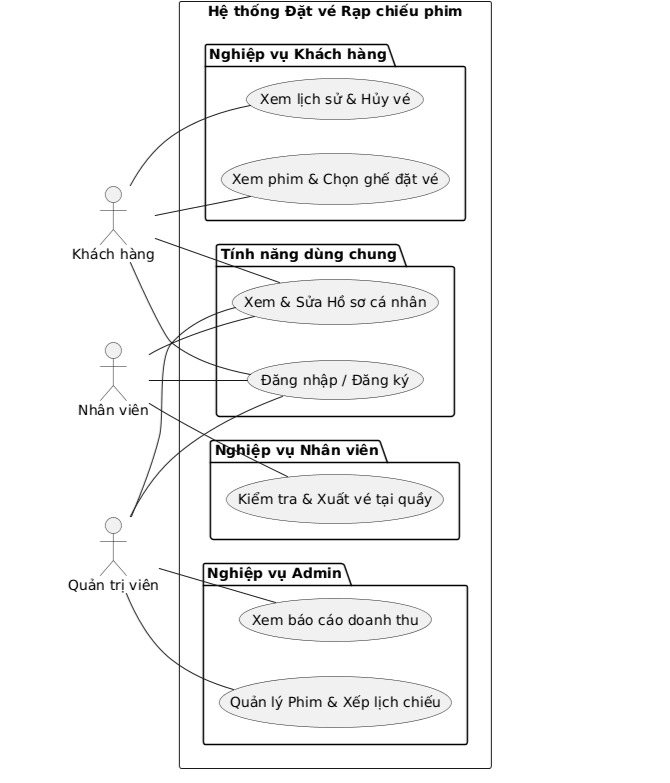
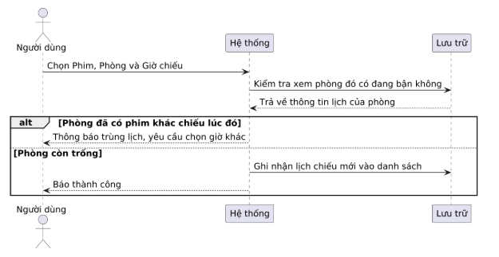
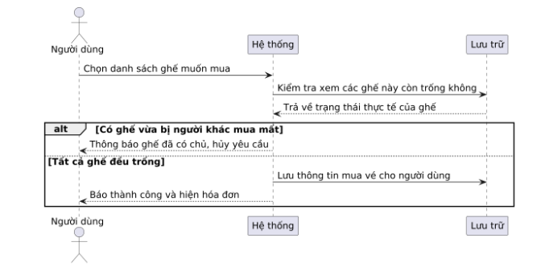
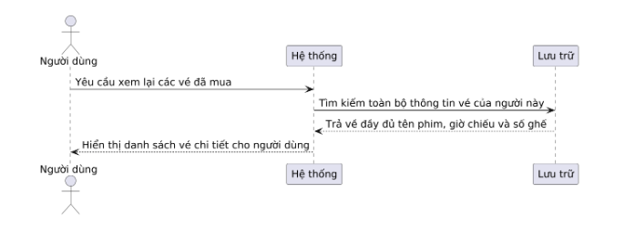
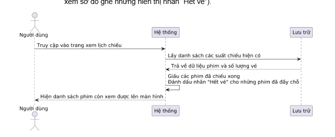
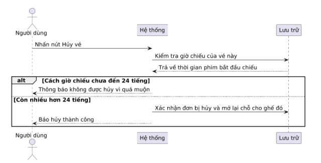

TÀI LIỆU ĐẶC TẢ YÊU CẦU (SRS) - PROJECT JAVA WEB
Tên dự án: Hệ thống Đặt vé Rạp chiếu phim (Smart Cinema Booking System)
Kiến trúc: Monolithic (Ứng dụng nguyên khối)
Tính chất: Phần Cốt lõi (Bắt buộc) + Các Module Mở rộng (Tự chọn)
1. MÔ TẢ TỔNG QUAN
   Hệ thống là một ứng dụng Web hoàn chỉnh phục vụ quy trình tra cứu phim, đặt vé xem phim và mua dịch vụ đi kèm (combo bắp nước). Toàn bộ mã nguồn (giao diện, xử lý nghiệp vụ, kết nối cơ sở dữ liệu) được đóng gói và triển khai trên cùng một máy chủ (VD: Tomcat).
   Các Tác nhân (Actors)
   Khách hàng: Đăng ký/đăng nhập, xem hồ sơ cá nhân; Xem phim (chọn phim), đặt vé (chọn ghế), xem lại lịch sử đã mua và bấm hủy vé (nếu thỏa mãn điều kiện thời gian).
   Nhân viên: Đăng nhập, xem hồ sơ cá nhân; Tra cứu mã đơn hàng của khách để xác nhận thanh toán hoặc in vé giấy tại quầy.
   Quản trị viên (Admin): Đăng nhập, xem hồ sơ cá nhân; Toàn quyền quản lý kho phim (thêm/sửa/xóa), thiết lập suất chiếu cho các phòng và xem báo cáo tổng tiền vé bán được.

2. PHẦN CỐT LÕI (CORE REQUIREMENTS) - BẮT BUỘC
   Phần này yêu cầu sinh viên phải xây dựng hoàn chỉnh luồng nghiệp vụ cơ bản. Dữ liệu được lưu trữ trong Relational Database (MySQL, PostgreSQL...).
   2.1. Quản lý Tài khoản & Phân quyền cơ bản
   CORE-01: Đăng ký, đăng nhập. Mật khẩu lưu trong database bắt buộc phải được băm (hash) bảo mật.
   CORE-02: Kiểm soát truy cập. Khách hàng không được vào trang của Nhân viên rạp; Nhân viên rạp không được vào trang cấu hình của Admin.
   CORE-03: Quản lý Hồ sơ cá nhân (Profile) cho từng loại người dùng.
   2.2. Luồng Đặt vé (Nghiệp vụ chính)
   CORE-04: Admin thực hiện quản lý (Thêm/Xem/Sửa/Xóa) cho danh mục Phim. Các danh mục "Thể loại phim", "Phòng chiếu" sẽ được hardcode (seed data) trực tiếp trong Database để làm dữ liệu nền tảng cho hệ thống.
   CORE-05 - Quản lý Suất chiếu (Showtime Scheduling): Admin tạo lịch chiếu bằng cách chọn: Phim + Phòng + Giờ bắt đầu.
   Yêu cầu nghiệp vụ (Core Logic): Hệ thống phải kiểm tra xung đột phòng. Một phòng tại một thời điểm không thể chiếu 2 phim.
   Ví dụ: Nếu suất chiếu A (Phòng 1) bắt đầu lúc 8h00 và phim dài 120 phút, thì không được phép tạo suất chiếu B (Phòng 1) trước 10h15 (tính cả thời gian dọn phòng).

CORE-06 - Thanh toán vé & Tính toàn vẹn dữ liệu (Transaction): Người dùng thao tác chọn ghế và xác nhận thanh toán.
Yêu cầu nghiệp vụ (Core Logic): Việc lưu hóa đơn tổng, và các bản ghi vé phải được tạo đồng thời.
Ví dụ: Nếu người A đặt ghế A1, A2, A3 nhưng chưa kịp xác nhận, mà có người B nhanh tay đặt mất A2, thì toàn bộ thao tác phải bị hủy, không lưu gì cả.

CORE-07 - Tra cứu Lịch sử: Khách hàng xem lại lịch sử các lần đặt vé trước đây.
Yêu cầu nghiệp vụ (Core Logic): Không dừng lại ở việc xem một danh sách đơn thuần, hệ thống phải truy xuất dữ liệu liên kết phức tạp giữa các bảng (JOIN) để trả về một "Hóa đơn" hoàn chỉnh bao gồm: Tên phim, Suất chiếu, Chi tiết danh sách ghế ngồi.

CORE-08 - Kiểm soát trạng thái Suất chiếu: Suất chiếu phải tự động thay đổi trạng thái hoặc bị ẩn đi khi:
Thời gian hiện tại đã vượt quá thời gian bắt đầu của suất chiếu (Ẩn hoàn toàn).
Toàn bộ ghế trong phòng của suất chiếu đó đã được đặt (Sold out) (Vẫn cho xem sơ đồ ghế nhưng hiển thị nhãn “Hết vé”).

CORE-09 - Hủy vé chủ động & Giải phóng Slot: Khách hàng được phép chủ động "Hủy vé" trước thời điểm chiếu một khoảng thời gian nhất định (VD: trước 24 giờ).
Yêu cầu nghiệp vụ: Khi người dùng hủy thành công, trạng thái hóa đơn cập nhật thành "Đã hủy". Quan trọng nhất, hệ thống phải "giải phóng" (Unlock) ghế ngồi đó ngay lập tức. Ghế này sẽ tự động hiển thị trở lại là "Còn trống" ở luồng CORE-06 để các khách hàng khác có thể đặt vào.

3. GỢI Ý THIẾT KẾ CƠ SỞ DỮ LIỆU (DATABASE SCHEMA GUIDELINES)
   Để triển khai thành công các luồng nghiệp vụ trên, đặc biệt là việc liên kết dữ liệu (JOIN) và quản lý giao dịch (Transaction), sinh viên cần thiết kế một hệ cơ sở dữ liệu chuẩn hóa (ít nhất đạt chuẩn 3NF). Dưới đây là gợi ý các thực thể (Entities) cốt lõi hệ thống cần có:
   Bảng users (Tài khoản): Quản lý thông tin xác thực và phân quyền.
   Bảng user_profiles (Hồ sơ người dùng): Lưu thông tin cá nhân chi tiết. Có thể gộp chung vào bảng users hoặc tách riêng để tối ưu.
   Bảng rooms (Phòng chiếu): Dữ liệu phòng chiếu phim cố định. (Hardcode)
   Bảng seats (ghế ngồi) (seat_id, seat_name): Dữ liệu ghế ngồi để liên kết đến bảng rooms (Hardcode).\
   Bảng genres (Thể loại): Dữ liệu thể loại phim cố định. (Hardcode)
   Bảng movies (Thông tin Phim): Thông tin các bộ phim đang được chiếu. (Create - Read - Update - Delete)
   Bảng showtimes (Suất chiếu): Bảng trung tâm kết nối phim, phòng chiếu và thời gian giải quyết bài toán chống xung đột. (Business quan trọng)
   Bảng bookings (Hóa đơn/Đơn đặt vé): Lưu trữ kết quả đặt vé tổng thể sau thanh toán (ngày đặt, tổng tiền, user id).
   Bảng tickets (Chi tiết vé/ghế): Bảng trung gian lưu chi tiết ghế ngồi (hoặc lưu seat_id để liên kết đến bảng seats) tương ứng với suất chiếu và hóa đơn.
   (Lưu ý: Sinh viên cần tự xác định đúng các Khóa chính (Primary Key), Khóa ngoại (Foreign Key) và vận dụng kiến thức Hibernate/JPA mapping ( @OneToMany , @ManyToOne , @ManyToMany ) để ánh xạ các bảng này thành Entity trong code Java).
4. KHÔNG GIAN MỞ RỘNG (OPEN EXTENSIONS) - DÀNH CHO NHÓM XUẤT SẮC
   Sinh viên tự chọn 1 hoặc nhiều hướng dưới đây để mở rộng ứng dụng Java Web của mình, chứng minh khả năng áp dụng các kỹ thuật lập trình nâng cao:
   Hướng 1: Tích hợp Thanh toán trực tuyến (Payment Integration)
   Mô tả: Chuyển đổi ứng dụng thành nền tảng có thanh toán thực tế khi đặt vé.
   Tính năng gợi ý:
   Tích hợp với một cổng thanh toán mô phỏng (Sandbox) như VNPay, Momo hoặc PayPal.
   Khi khách tạo đơn, trạng thái là CHỜ_THANH_TOÁN. Chỉ khi cổng thanh toán trả về kết quả thành công, đơn vé mới chuyển sang ĐÃ_XÁC_NHẬN.
   Yêu cầu kỹ thuật: Xử lý tốt các dữ liệu được gửi từ Controller, Java Backend ra dịch vụ bên ngoài và xử lý Callback/Webhook an toàn.
   Hướng 2: Bảo mật Nâng cao & Quản lý Session (Advanced Security)
   Mô tả: Nâng cấp cơ chế bảo mật của ứng dụng Web
   Tính năng gợi ý:
   Có thể sử dụng cơ chế Interceptors để làm và phân quyền.
   Có thể sử dụng Spring Security (nếu dùng Spring Boot) hoặc Filter/Interceptor (nếu dùng Servlet/JSP thuần) để quản lý luồng bảo mật tập trung.
   Có thể sử dụng bằng JWT (JSON Web Token) hoặc thêm tính năng Đăng nhập bằng Google/Facebook (OAuth2).
   Phân quyền chi tiết đến từng nút bấm (View) và từng đường dẫn (URI Endpoint).
   Hướng 3: Xử lý Bất đồng bộ & Tự động hóa (Async & Background Jobs)
   Mô tả: Cải thiện trải nghiệm người dùng bằng cách không bắt họ chờ đợi các tác vụ tốn thời gian.
   Tính năng gợi ý:
   Gửi mã vé (QR) qua Email tự động: Sau khi thanh toán thành công, hệ thống gửi email mã QR vé. Giao dịch gửi email phải chạy ngầm (Async/Thread riêng) để không làm chậm thao tác trên giao diện của người dùng.
   Background Task (Cron Job): Viết một tiến trình chạy ngầm mỗi 1 phút để tự động quét và giải phóng các ghế (hủy đơn) đang ở trạng thái CHỜ_THANH_TOÁN nhưng đã quá 15 phút.
   Hướng 4: Tối ưu hóa Truy vấn & Báo cáo thống kê (Database Optimization)
   Mô tả: Đảm bảo ứng dụng chạy nhanh khi dữ liệu phình to.
   Tính năng gợi ý:
   Xây dựng trang Dashboard cho Admin: Thống kê doanh thu theo tháng, Top 5 bộ phim có doanh thu cao nhất (vẽ Biểu đồ).
   Yêu cầu kỹ thuật: Không dùng vòng lặp for trong Java để tính toán tổng. Sinh viên phải viết các câu lệnh truy vấn SQL nâng cao (JOIN, GROUP BY, HAVING) hoặc sử dụng các Query chuyên sâu của Hibernate/JPA để lấy dữ liệu thống kê trực tiếp từ Database.
5. QUY ĐỊNH KỸ THUẬT & TIÊU CHÍ CHẤM ĐIỂM
   Kiến trúc mã nguồn (Code Architecture): Tổ chức code chuẩn theo mô hình 3 lớp: Controller (Xử lý request/response) - Service (Chứa logic nghiệp vụ) - Repository/DAO (Tương tác Database). Tuyệt đối không viết logic kết nối Database trực tiếp trong Controller.
   Sử dụng pattern DTO (Data Transfer Object) để truyền dữ liệu giữa Client và Server, không phơi bày trực tiếp Entity của Database ra ngoài.
   Quản lý Giao dịch (Transaction Management): Xử lý đúng các nghiệp vụ lưu nhiều bảng cùng lúc (Ví dụ: Vừa lưu Hóa đơn đặt vé, vừa lưu Chi tiết Combo và Chi tiết Ghế ngồi). Nếu một bước lỗi, toàn bộ phải được Rollback để tránh rác dữ liệu.
   Tiêu chí đánh giá:
   Hoàn thành luồng CORE mượt mà, code sạch sẽ: Đạt điểm Khá.
   Hoàn thành CORE + Tích hợp thành công 1 Hướng Mở rộng: Đạt điểm Giỏi.
   Giao diện thân thiện, xử lý bắt lỗi (Validation) đầy đủ ở cả Client và Server, cấu trúc code tuân thủ chặt chẽ OOP: Đạt điểm Xuất sắc.
